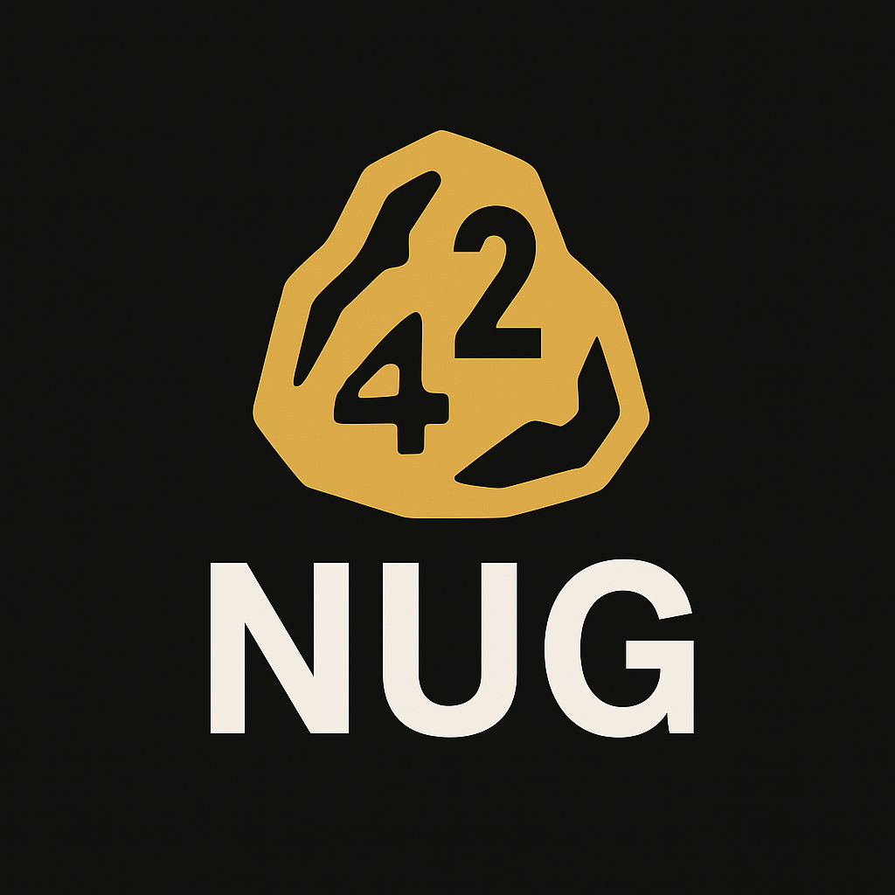

# 42nug (NFT)



## Overview

This documentation describes the 42nug NFT project implemented for the Ethereum ecosystem using Solidity and the Remix IDE. It focuses on creating, deploying, and interacting with ERC-721 NFTs, handling metadata, and common deployment workflows with MetaMask.

## Concepts

### Web3 / Ethereum

Ethereum is a decentralized platform for smart contracts and dApps. NFTs (non-fungible tokens) on Ethereum are commonly implemented with the ERC-721 standard.

Key concepts:
- Transactions, gas, and accounts
- Smart contracts written in Solidity
- Testnets (Sepolia, Goerli) for development and testing

### NFTs (ERC-721)

ERC-721 defines a standard interface for non-fungible tokens. Each token has a unique identifier (tokenId) and can reference metadata (tokenURI) which describes the asset and points to an image or JSON metadata, often stored on IPFS.

Benefits of ERC-721:
- Unique tokens with provenance
- Broad marketplace and wallet support
- Flexible metadata via tokenURI

### Metadata & Storage

NFT metadata should include fields like `name`, `description`, and `image` (usually an IPFS URL or a data URI). Common approaches:
- Host images and metadata on IPFS (recommended)
- Use Pinata, nft.storage, or other pinning services
- Store only the tokenURI on-chain to save gas

## Tools & Libraries

- Remix IDE — quick in-browser development and deployment: https://remix.ethereum.org/
- MetaMask — browser wallet to deploy and interact: https://metamask.io/
- OpenZeppelin Contracts — secure ERC-721 implementations: https://docs.openzeppelin.com/contracts/
- ethers.js — JS library to interact with contracts: https://docs.ethers.org/
- IPFS / Pinata / nft.storage — decentralized storage for assets and metadata

## Development Setup (Remix + MetaMask)

1. Open Remix: https://remix.ethereum.org/.
2. Create a new Solidity file (e.g., `NFT.sol`).
3. Install or reference OpenZeppelin contracts via the Remix import URL.
4. Connect MetaMask to a testnet (Sepolia or Goerli) and request test ETH from a faucet.
5. Compile the contract with the Remix compiler (select appropriate Solidity version).
6. Deploy using the Injected Web3 environment (MetaMask), confirm the transaction, and copy the deployed address.
7. Interact with public `mint` or `safeMint` functions from Remix or via a frontend using ethers.js.

## Frontend Integration (ethers.js)

- Connect MetaMask and request accounts with `ethereum.request({ method: 'eth_requestAccounts' })`.
- Create a `BrowserProvider` or `Web3Provider` and obtain a signer.
- Instantiate the contract with the deployed address and the ERC-721 ABI, and call `mint` or `safeMint` through the signer.

Simple pattern (pseudo-code):

```javascript
const provider = new ethers.providers.Web3Provider(window.ethereum);
await provider.send('eth_requestAccounts', []);
const signer = provider.getSigner();
const contract = new ethers.Contract(address, ABI, signer);
await contract.mint(toAddress, tokenURI);
```

## Metadata Example (JSON)

Host a JSON file on IPFS with fields like:

```json
{
  "name": "42nug #1",
  "description": "A nug of 42",
  "image": "ipfs://<CID>/image.png",
  "attributes": []
}
```

Then pass the IPFS URL as the `tokenURI` when minting.

## Deployment Best Practices

- Test thoroughly on Sepolia or Goerli before mainnet deployment.
- Use OpenZeppelin contracts to avoid common pitfalls.
- Avoid storing large data on-chain; use off-chain storage (IPFS) for images and metadata.
- Consider gas optimizations and upgradeable patterns only if needed.

## Troubleshooting

- CORS when calling public RPC endpoints: use a provider that supports CORS (Alchemy/Infura) or run a backend proxy.
- If `mint` reverts: check `require` conditions, gas limits, and the owner/role permissions.
- Metadata not showing on marketplaces: ensure metadata JSON and image are pinned and accessible via IPFS gateway or HTTPS.

## Useful Links

- Remix: https://remix.ethereum.org/
- OpenZeppelin: https://docs.openzeppelin.com/contracts/4.x/
- ethers.js: https://docs.ethers.org/
- IPFS: https://ipfs.io/
- Etherscan: https://etherscan.io/ (switch network as needed)

---

This documentation is focused on Ethereum + Remix workflows for NFT (ERC-721) projects. Adjust contract examples and deployment steps to match your specific use case.
